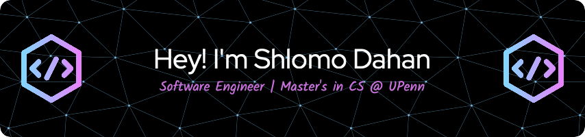

<!---->

 

---

<!--With a background in finance and a passion for technology, I've transitioned from crunching numbers to crafting code. My drive? Solving problems and creating value. As I currently pursue my Master's in CS from the University of Pennsylvania, I've channeled my analytical skills towards software engineering, with a particular interest in the world of startups.
-->
## 🛠 Languages & Tools:

- **Languages**: 

- **Frameworks & Libraries**: 

- **Databases**: 

<!-- ## 📚 **Recent Projects**

- 📝 **VeriCreds: A Web3 PoC Project** 
-- An MVP demonstrating decentralized document sharing via blockchain. [VeriCreds WebApp](https://github.com/shlomomdahan/vericreds-frontend) | [VeriCreds Backend](https://github.com/shlomomdahan/vericreds-backend)

- 🦠 **Analyzing COVID Patterns with Machine Learning** 
 -- Developed a framework for predicting COVID patterns using machine learning libraries like PyTorch. [Project Link](https://github.com/shlomomdahan/machine-learning)

## 🌍 A Bit More About Me:

- 📈 **Past Life**: Managed UHNW client portfolios at **J.P. Morgan**
- 🚴‍♂️ **Triathlete**: Currently training for an Ironman
- :rocket: **Fun fact**: Fluent in Spanish and French

<!-- 
---

 

